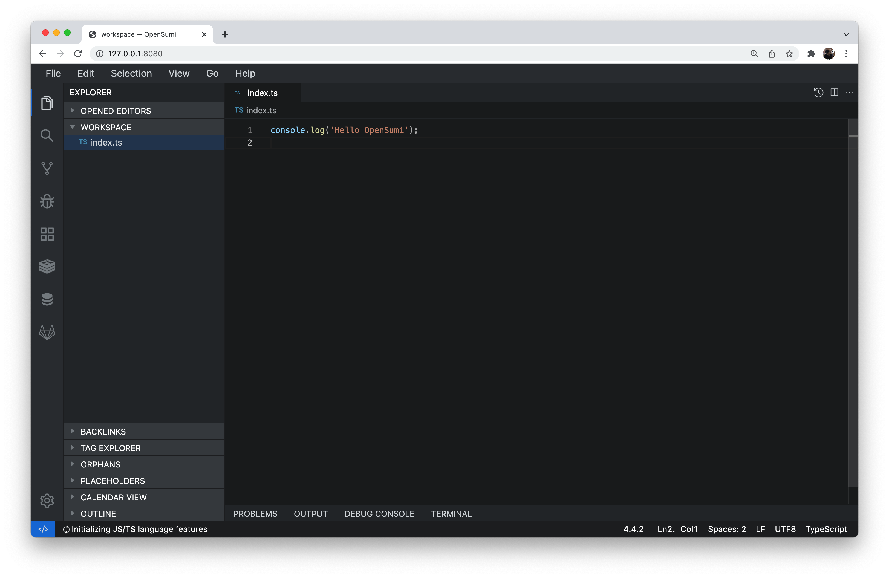

## OpenSumi Web 集成示例

本项目为基于 OpenSumi 框架的 Web 版 IDE 集成示例

### 项目结构

```bash
.
└── workspace                   # 工作目录
├── extensions                  # 插件目录
├── configs                     # webpack 配置
├── src
│   ├── browser
│   └── node
├── tsconfig.json
├── package.json
└── README.md
```

### 启动

```bash
$ git clone git@github.com:opensumi/ide-startup.git
$ cd startup
$ yarn              # 安装依赖后会自动执行 prepare，编译 Node.js 和 WebWorker 两个插件环境, 下载默认插件
$ yarn start          # 启动前端、后端服务器及 Webview Host
```

浏览器打开 `http://127.0.0.1:8080`



### 构建及运行 Docker 镜像

```bash
# 构建镜像
docker build . -t opensumi-web:1.0
# 运行
docker run --rm -d  -p 8080:8000/tcp opensumi-web:1.0
```

浏览器打开 `http://127.0.0.1:8080`
